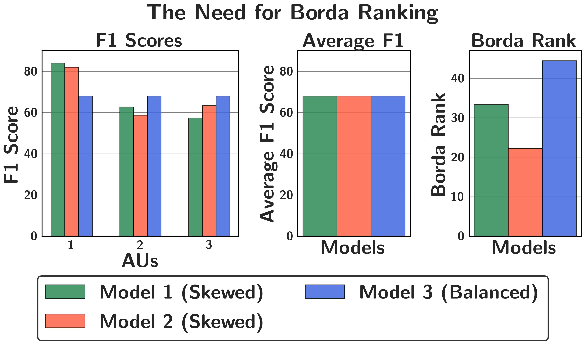
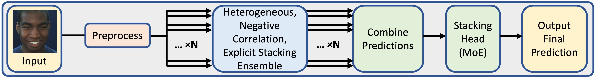
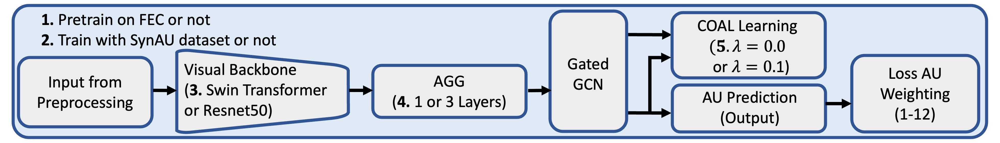
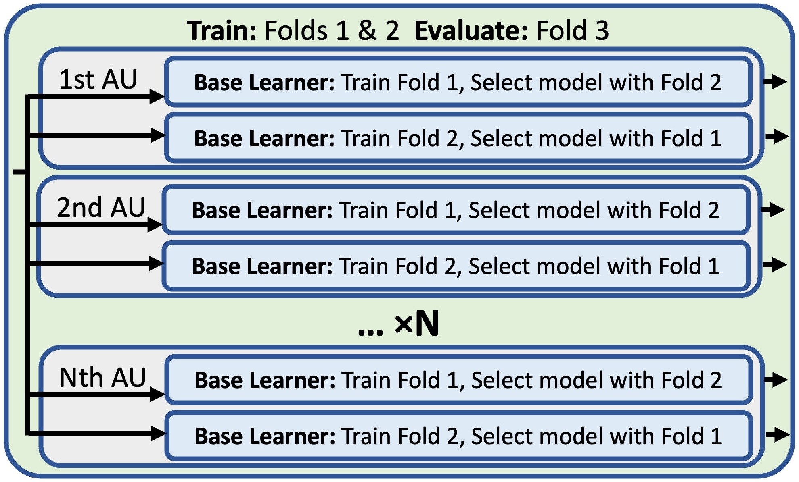

# Borda Ranking with Synthetic Data and Ensembles for Facial Action Unit Recognition



Borda Ranking with Synthetic Data and Ensembles for Facial Action Unit Recognition

Author names here (removed for blind review)

## Guide to running the code:

As the code is rather large, we provide descriptions of possible desired tasks in different sections. Each section is outlined here. 

Section outlines:
0. Download this github repo.
1. Download model parameters: Information about what is included and what/why it is not included in this CVPR anonymous review.
2. Conda environment: Instructions for setting up a conda environment.
3. Uncompress all: Instructions to uncompress the necessary files before running the various tests below.
4. Testing the stacking head: Instructions to validate the final results reported in the paper. (Do not need to run the base learners prior to this step. We include each of the base learners' predictions saved in data/predictions.)
5. Preprocessing: The necessary preprocessing to run each of the base learners.
6. Testing the base learners: Instructions for validating the base learners.
7. SynAU dataset: Instructions for viewing the SynAU dataset and the code used to generate the SynAU dataset.

## 0. Download this github repo.

Linux:
```bash
sudo apt install git-lfs
git lfs install
git clone THIS_REPO
```

If you desire to run any code, you need to do a git clone and not download the zip file. If you only desire to look at the code, downloading the zip file will work. This is because the data is included with git LFS which will only download the files using git clone. 

There is ~50G in the initial download. You will need an additional ~100G to run the full uncompress all. If one does not have enough storage for this, they may modify the preprocessing/uncompress_all.py to only uncompress those items that are needed for the desired task. Also, after the initial cloning, large files that one does not plan to use may be deleted.

We explain the need for the large files in this github repo in Section 1 (Download model parameters) below.

## 1. Download model parameters:

To respect the November 7, 2024 update from CVPR, we include the following large files in our repository:
- Each base leaners' predictions for the BP4D dataset (See: data/predictions/BP4D_compressed)
- Each base leaners' predictions for the DISFA dataset (See: data/predictions/DISFA_compressed)
- Model weights for the stacking head (MoE) on the BP4D dataset (See: data/weights/stacking_head/BP4D_compressed)
- Model weights for the stacking head (MoE) on the DISFA dataset (See: data/weights/stacking_head/DISFA_compressed)
- The SynAU dataset (See: data/datasets/SynAU_compressed)

#### CVPR November 7, 2024 update: 
"Please note a small change in the author guidelines compared to CVPR 2024: we no longer allow any links to external websites in the supplementary material unless it is to an anonymous GitHub repository. This is because we cannot track external links without a third-party timestamp to make sure no new material is updated after the supplementary material deadline. In previous conferences, this was already highly discouraged, but CVPR 2025 decides to disallow it to avoid potential misuse." (cited on Nov 20, 2024 from Link: https://cvpr.thecvf.com/Conferences/2025/Clarification)

Upon acceptance, we will release our code publically. We will release all large files linked to an external website, rather than the inclusion within the git repository. We see the inclusion of the large files in github to be inefficient for downloading the code. In addition to the above mentioned large files, we will also release:
- Model weights for each base learner on the BP4D dataset
- Model weights for each base learner on the DISFA dataset

## 2. Conda environment:
Assumed prerequisites:
- Understanding of conda. (If not, please view an external online tutorial)


```bash
conda env create -f ennvironment.yml
```


## 3. Uncompress all:
Prerequisites:
- Conda environment (created and activated).

```bash
python preprocessing/uncompress_all.py
```

## 4. Testing the stacking head:
Prerequisites: 
- Conda environment (created and activated).
- Uncompress all.

The testing of the stacking heads is run through a bash script. The number after the bash script is the fold number. The results will be output to the results directory.

BP4D:

```bash
./scripts/test_BP4D.sh 1 && ./scripts/test_BP4D.sh 2 && ./scripts/test_BP4D.sh 3 
```

DISFA:
```bash
./scripts/test_DISFA.sh 1 && ./scripts/test_DISFA.sh 2 && ./scripts/test_DISFA.sh 3 
```

## 5. Preprocessing:
Prerequisites:
- Conda environment.
- Uncompress all.
- Access to BP4D and DISFA datasets from the respective institutions. Due to licensing requirements, we cannot provide this data but rather point others to the respective locations for the BP4D-spontaneous and DISFA datasets.


```bash
./scripts/mat_to_np.sh path/to/DISFA/Videos_LeftCamera
./scripts/dataset_prep_BP4D.sh
./scripts/dataset_prep_DISFA.sh
```

Create a python environment with the following requirements to run the cropping to the face. 
    - Python 3.6.4
    - mxnet 1.2.0
    - numpy 1.14.0
    - scikit-image 0.14.0 
    - python-opencv 3.4.3
    - tqdm 4.28.1

```bash
./scripts/cropFace_BP4D.sh path/to/BP4D/BP4D_imagesOnly
./scripts/cropFace_DISFA.sh path/to/DISFA/Videos_LeftCamera
```


## 6. Testing the base learners:
Prerequisites: 
- Conda environment.
- Uncompress all.
- Preprocessing.

Due to the limited space allowed on our git LFS, we do not include the weights for the base learners. As discussed earlier in this document, following the clarification of CVPR we are unable to provide with an external link. However, upon acceptance we release them on a different website than github.

However, when one has the weights you run it by doing the following. The output is stored in data/predictions/BP4D_computeLocal which is the same data as we provide in data/predictions/BP4D_compressed.

BP4D (baselearners options 0-68):
```bash
./scripts/runBaseLearners_BP4D.sh OPTION_NUMBER_HERE
```

DISFA (baselearners options 0-46):
```bash
./scripts/runBaseLearners_DISFA.sh OPTION_NUMBER_HERE
```


## 7. SynAU dataset:
Prerequisites:
- Uncompress all.

View dataset in data/datasets/SynAU directory. To look at the code to generate the SynAU dataset please look in the data/datasets/SynAU_generate directory. The data/datasets/SynAU_generate/README.md provides the necessary information used to generate the SynAU dataset and more.


## Architecture Overview:



## Base Model Overview:



## Stacking Diagram:




## Results

### BP4D:
| Method               | Venue | AU 1 | AU 2 | AU 4 | AU 6 | AU 7 | AU 10 | AU 12 | AU 14 | AU 15 | AU 17 | AU 23 | AU 24 | Avg. F1 Score | Borda Ranking |
|----------------------|--------------|------|------|------|------|------|-------|-------|-------|-------|-------|-------|-------|------------|------|
|DRML 		|	CVPR 2016 	|	36.4 	|	41.8 	|	43.0 	|	55.0 	|	67.0 	|	66.3 	|	65.8 	|	54.1 	|	33.2 	|	48.0 	|	31.7 	|	30.0 	|	48.3 	|	1.9 |
|EAC-Net 	|	PAMI 2018 	|	39.1 	|	35.2 	|	48.6 	|	76.1 	|	72.9 	|	81.9 	|	86.2 	|	58.8 	|	7.5 	|	59.1 	|	35.9 	|	35.8 	|	55.9 	|	5.7 |
|JAA-Net 	|	ECCV 2018 	|	47.2 	|	44.0 	|	54.9 	|	77.5 	|	74.6 	|	84.0 	|	86.9 	|	61.9 	|	43.6 	|	60.3 	|	42.7 	|	41.9 	|	60.0 	|	22.3 |
|LP-Net		|	CVPR 2019 	|	43.4 	|	38.0 	|	54.2 	|	77.1 	|	76.7 	|	83.8 	|	87.2 	|	63.3 	|	45.3 	|	60.5 	|	48.1 	|	54.2 	|	61.0 	|	26.1 |
|ARL 		|	T-AFFC 2019 	|	45.8 	|	39.8 	|	55.1 	|	75.7 	|	77.2 	|	82.3 	|	86.6 	|	58.8 	|	47.6 	|	62.1 	|	47.4 	|	55.4 	|	61.1 	|	26.1 |
|AU-GCN 	|	MMM 2020 	|	46.8 	|	38.5 	|	60.1 	|	80.1 	|	79.5 	|	84.8 	|	88.0 	|	67.3 	|	52.0 	|	63.2 	|	40.9 	|	52.8 	|	62.8 	|	50.4 |
|SRERL 		|	AAAI 2019 	|	46.9 	|	45.3 	|	55.6 	|	77.1 	|	78.4 	|	83.5 	|	87.6 	|	63.9 	|	52.2 	|	63.9 	|	47.1 	|	53.3 	|	62.9 	|	39.4 |
|UGN-B 		|	AAAI 2021 	|	54.2 	|	46.4 	|	56.8 	|	76.2 	|	76.7 	|	82.4 	|	86.1 	|	64.7 	|	51.2 	|	63.1 	|	48.5 	|	53.6 	|	63.3 	|	36.0 |
|HMP-PS 	|	CVPR 2021 	|	53.1 	|	46.1 	|	56.0 	|	76.5 	|	76.9 	|	82.1 	|	86.4 	|	64.8 	|	51.5 	|	63.0 	|	49.9 	|	54.5 	|	63.4 	|	38.3 |
|SEV-Net 	|	CVPR 2021 	|	58.2 	|	50.4 	|	58.3 	|	81.9 	|	73.9 	|	87.8 	|	87.5 	|	61.6 	|	52.6 	|	62.2 	|	44.6 	|	47.6 	|	63.9 	|	54.2 |
|AUFM 		|	CVPR 2023 	|	57.4 	|	52.6 	|	64.6 	|	79.3 	|	81.5 	|	82.7 	|	85.6 	|	67.9 	|	47.3 	|	58.0 	|	47.0 	|	44.9 	|	64.1 	|	52.7 |
|PIAP 		|	ICCV 2021 	|	54.2 	|	47.1 	|	54.0 	|	79.0 	|	78.2 	|	86.3 	|	89.5 	|	66.1 	|	49.7 	|	63.2 	|	49.9 	|	52.0 	|	64.1 	|	53.8 |
|FAUDT 		|	CVPR 2021 	|	51.7 	|	49.3 	|	61.0 	|	77.8 	|	79.5 	|	82.9 	|	86.3 	|	67.6 	|	51.9 	|	63.0 	|	43.7 	|	56.3 	|	64.2 	|	50.8 |
|FG-Net 	|	WACV 2024 	|	52.6 	|	48.8 	|	57.1 	|	79.8 	|	77.5 	|	85.6 	|	89.3 	|	68.0 	|	45.6 	|	64.8 	|	46.2 	|	55.7 	|	64.3 	|	63.3 |
|KDSRL 		|	CVPR 2022 	|	53.3 	|	47.4 	|	56.2 	|	79.4 	|	80.7 	|	85.1 	|	89.0 	|	67.4 	|	55.9 	|	61.9 	|	48.5 	|	49.0 	|	64.5 	|	60.2 |
|KS 		|	ICCV 2023 	|	55.3 	|	48.6 	|	57.1 	|	77.5 	|	81.8 	|	83.3 	|	86.4 	|	62.8 	|	52.3 	|	61.3 	|	51.6 	|	58.3 	|	64.7 	|	56.1 |
|GMRP 		|	T-AFFC 2024 	|	54.7 	|	50.8 	|	57.1 	|	78.8 	|	79.6 	|	84.6 	|	88.0 	|	67.0 	|	54.9 	|	62.9 	|	48.6 	|	54.5 	|	65.1 	|	61.7 |
|ME-GraphAU 	|	IJCAI 2022 	|	52.7 	|	44.3 	|	60.9 	|	79.9 	|	80.1 	|	85.3 	|	89.2 	|	69.4 	|	55.4 	|	64.4 	|	49.8 	|	55.1 	|	65.5 	|	70.8 |
|SACL 		|	T-AFFC 2024 	|	57.8 	|	48.8 	|	59.4 	|	79.1 	|	78.8 	|	84.0 	|	88.2 	|	65.2 	|	56.1 	|	63.8 	|	50.8 	|	55.2 	|	65.6 	|	67.8 |
|AUFormer 	|	ECCV 2024 	|	55.2 	|	52.2 	|	63.2 	|	79.3 	|	79.7 	|	84.2 	|	88.6 	|	67.0 	|	53.3 	|	65.5 	|	50.6 	|	55.7 	|	66.2 	|	76.5 |
|GTLE-Net 	|	Appl. Intell. 	|	58.2 	|	48.7 	|	61.5 	|	78.7 	|	79.2 	|	84.2 	|	89.8 	|	66.3 	|	56.7 	|	64.8 	|	53.5 	|	53.6 	|	66.3 	|	73.9 |
|ELEGANT 	|	Under Review 	|	57.4 	|	50.1 	|	66.9 	|	79.2 	|	80.4 	|	84.9 	|	89.5 	|	68.9 	|	55.2 	|	65.6 	|	50.8 	|	59.1 	|	67.3 	|	86.0 |
|EnsembleAU (Ours) 	|		|	57.8 	|	51.7 	|	62.2 	|	79.1 	|	80.8 	|	85.6 	|	89.3 	|	69.9 	|	55.6 	|	65.1 	|	51.0 	|	57.9 	|	67.2 	|	88.3 |

Note: We acknowledge the slight discrepancy between a few reported numbers here (row "EnsembleAU (Ours)") and the numbers in Tab. 3 (row "EnsembleAU (ours)") in our paper. In finalizing the code, we discovered a slight rounding error that we will update in the final version of the paper upon acceptance. The slight rounding error does not change our findings, maintaining an average F1 score of 67.2 with a Borda ranking of 88.3, similar to the originally reported Borda ranking number of 87.5 in the paper. The averaging error does not affect any findings throughout our paper. In addition, maintaining consistency with the submission criteria, no additional results were found after submitting our paper as this is only a brief clarification of results.


### DISFA:

| Method               | Venue | AU 1 | AU 2 | AU 4 | AU 6 | AU 9 | AU 12 | AU 25 | AU 26 | Avg. F1 Score | Borda Ranking |
|----------------------|------------|------|------|------|------|------|-------|-------|-------|---------------|------|
|DRML		|	CVPR 2016	|	17.3	|	17.7	|	37.4	|	29.0	|	10.7	|	37.7	|	38.5	|	20.1	|	26.1	|	0.6 |
|EAC-Net 	|	PAMI 2018	|	41.5	|	26.4	|	66.4	|	50.7	|	80.5	|	89.3	|	88.9	|	15.6	|	48.5	|	42.0 |
|AU-GCN		|	MMM 2020	|	32.3	|	19.5	|	55.7	|	57.9	|	61.4	|	62.7	|	90.9	|	60.0	|	55.0	|	39.8 |
|SRERL		|	AAAI 2019	|	45.7	|	47.8	|	59.6	|	47.1	|	45.6	|	76.5	|	84.3	|	43.6	|	55.9	|	29.5 |
|JAA-Net	|	ECCV 2018	|	43.7	|	46.2	|	56.0	|	41.4	|	44.7	|	69.6	|	88.3	|	58.4	|	56.0	|	21.0 |
|LP-Net		|	CVPR 2019	|	29.9	|	24.7	|	72.7	|	46.8	|	49.6	|	72.9	|	93.8	|	65.0	|	56.9	|	40.9 |
|AUFM		|	CVPR 2023	|	41.5	|	44.9	|	60.3	|	51.5	|	50.3	|	70.4	|	91.3	|	55.3	|	58.2	|	33.5 |
|ARL		|	T-AFFC 2019	|	43.9	|	42.1	|	63.6	|	41.8	|	40.0	|	76.2	|	95.2	|	66.8	|	58.7	|	42.6 |
|SEV-Net	|	CVPR 2021	|	55.3	|	53.1	|	61.5	|	53.6	|	38.2	|	71.6	|	95.7	|	41.5	|	58.8	|	44.9 |
|UGN-B		|	AAAI 2021	|	43.3	|	48.1	|	63.4	|	49.5	|	48.2	|	72.9	|	90.8	|	59.0	|	60.0	|	35.2 |
|HMP-PS		|	CVPR 2021	|	38.0	|	45.9	|	65.2	|	50.9	|	50.8	|	76.0	|	93.3	|	67.6	|	61.0	|	48.9 |
|FAUDT		|	CVPR 2021	|	46.1	|	48.6	|	72.8	|	56.7	|	50.0	|	72.1	|	90.8	|	55.4	|	61.5	|	52.3 |
|KS		|	ICCV 2023	|	53.8	|	59.9	|	69.2	|	54.2	|	50.8	|	75.8	|	92.2	|	46.8	|	62.8	|	55.7 |
|ME-GraphAU	|	IJCAI 2022	|	54.6	|	47.1	|	72.9	|	54.0	|	55.7	|	76.7	|	91.1	|	53.0	|	63.1	|	63.6 |
|PIAP		|	ICCV 2021	|	50.2	|	51.8	|	71.9	|	50.6	|	54.5	|	79.7	|	94.1	|	57.2	|	63.8	|	63.6 |
|GMRP		|	T-AFFC 2024	|	62.6	|	54.7	|	70.8	|	46.3	|	51.7	|	76.3	|	94.4	|	59.8	|	64.6	|	63.1 |
|KDSRL		|	CVPR 2022	|	60.4	|	59.2	|	67.5	|	52.7	|	51.5	|	76.1	|	91.3	|	57.7	|	64.5	|	59.1 |
|FG-Net		|	WACV 2024	|	63.6	|	66.9	|	72.5	|	50.7	|	48.8	|	76.5	|	94.1	|	50.1	|	65.4	|	64.8 |
|SACL		|	T-AFFC 2024	|	62.0	|	65.7	|	74.5	|	53.2	|	43.1	|	76.9	|	95.6	|	53.1	|	65.5	|	72.2 |
|AUFormer	|	ECCV 2024	|	58.6	|	61.0	|	70.4	|	52.4	|	58.1	|	73.0	|	90.8	|	66.9	|	66.4	|	63.6 |
|GTLE-Net	|	Appl. Intell.	|	64.5	|	63.2	|	70.1	|	47.7	|	53.6	|	76.2	|	94.8	|	65.1	|	66.9	|	69.9 |
|ELEGANT	|	Under Review	|	67.2	|	64.1	|	74.2	|	52.2	|	47.0	|	73.1	|	95.1	|	69.8	|	67.8	|	74.4 |
|EnsembleAU (Ours)	|		|	69.2	|	61.1	|	71.7	|	53.6	|	49.2	|	76.6	|	93.2	|	68.2	|	67.9	|	75.6 |


## BibTeX


```bibtex
@misc{yourproject2024,
  author = {Removed for blind review},
  title = {Borda Ranking with Synthetic Data and Ensembles for Facial Action Unit Recognition},
  year = {TO BE FILLED AFTER ACCEPTANCE/PUBLICATION.},
  publisher = {TO BE FILLED AFTER ACCEPTANCE/PUBLICATION.}
}
